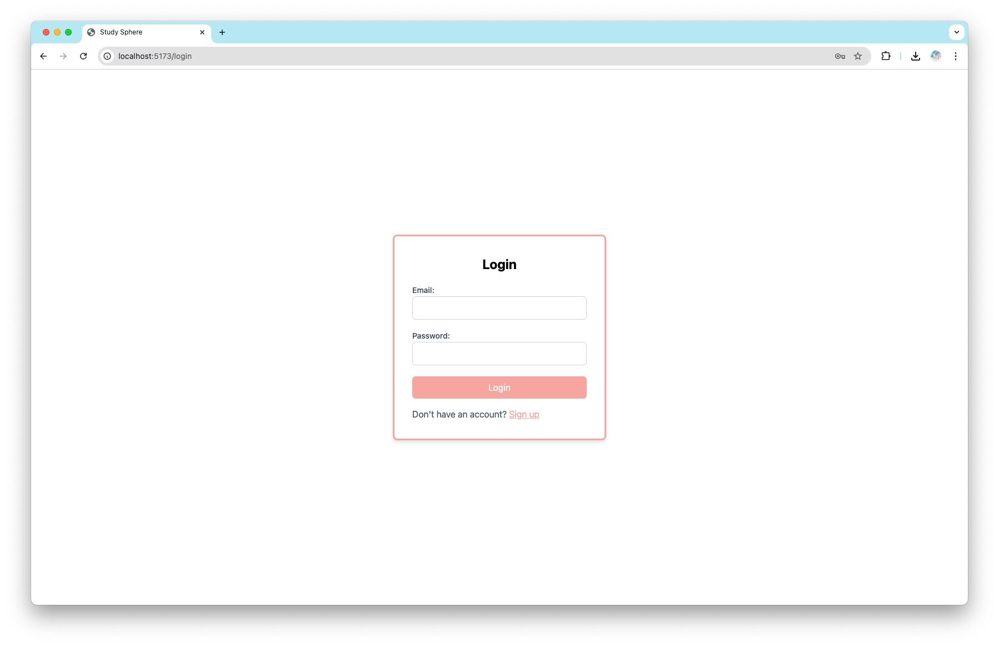
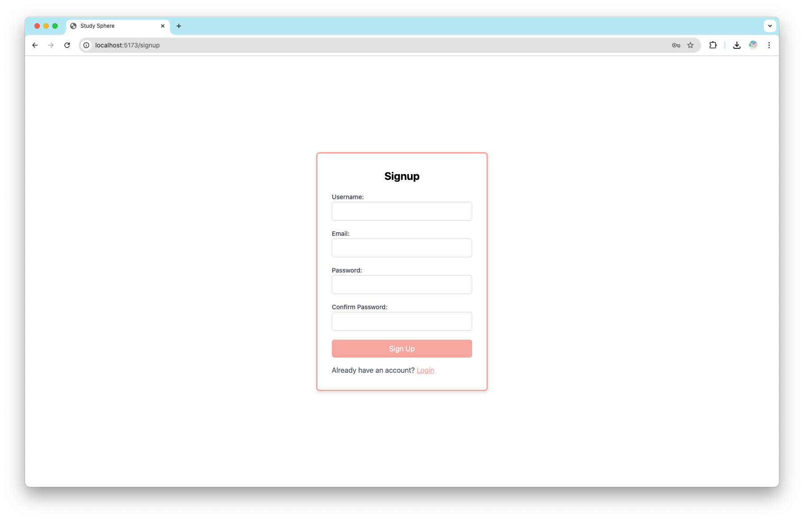
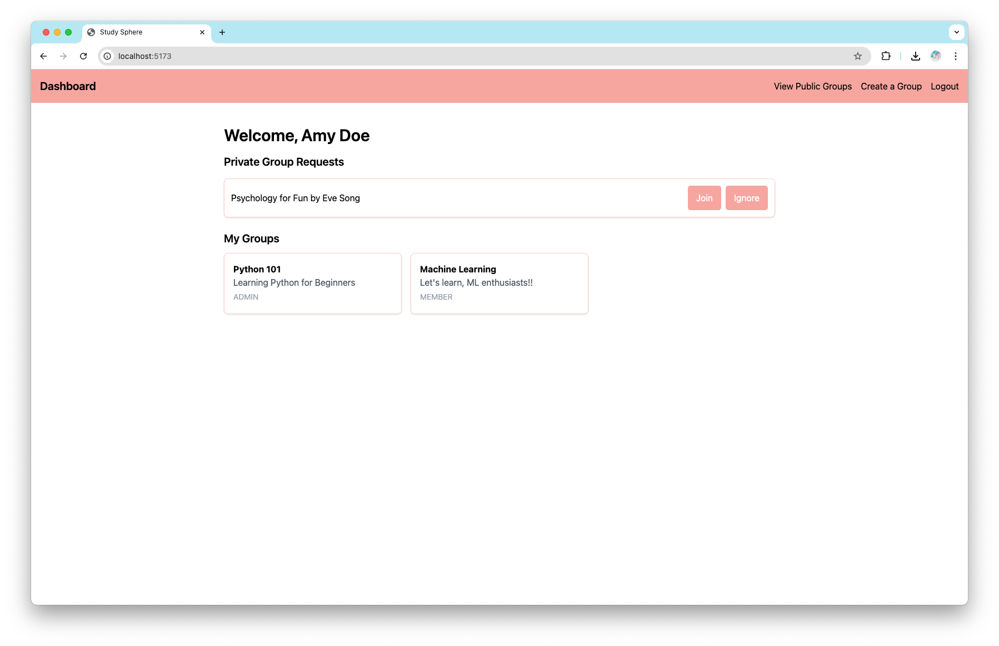
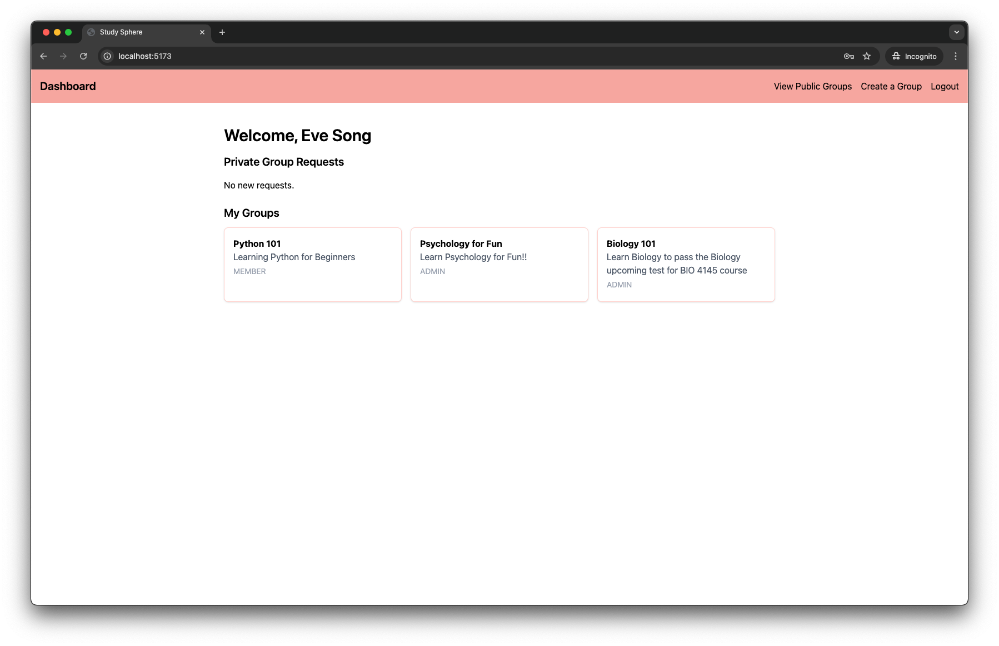
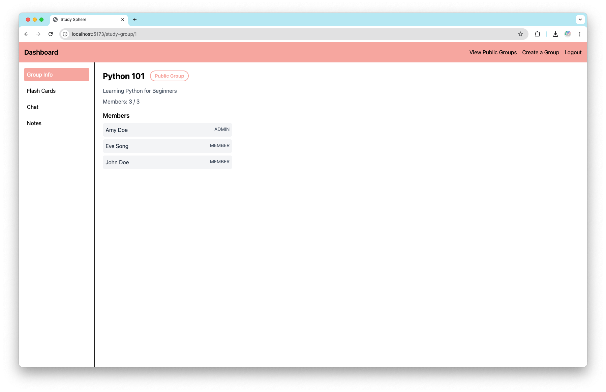
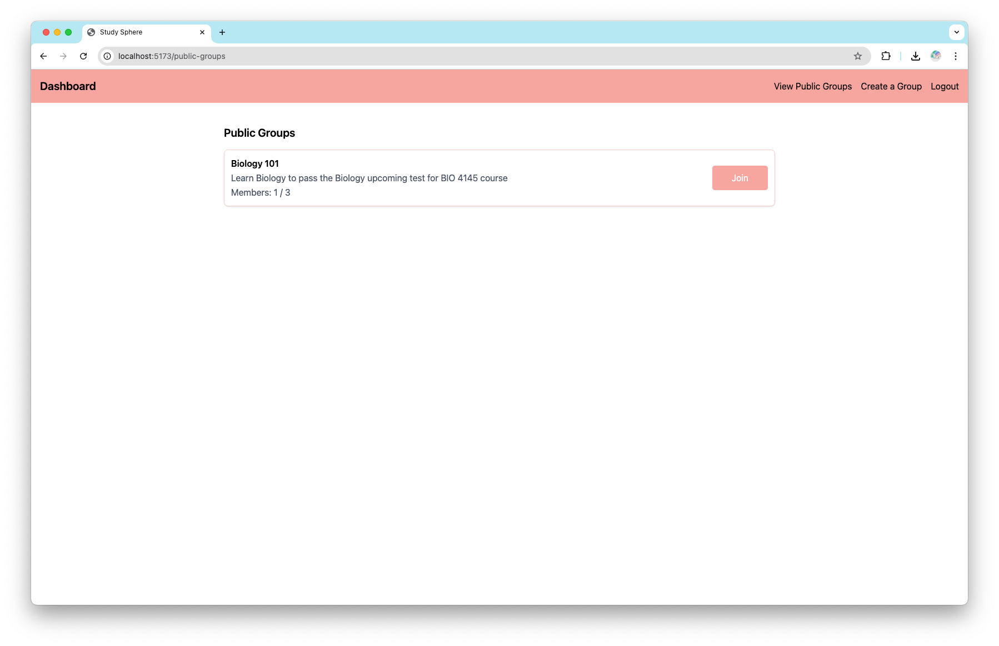
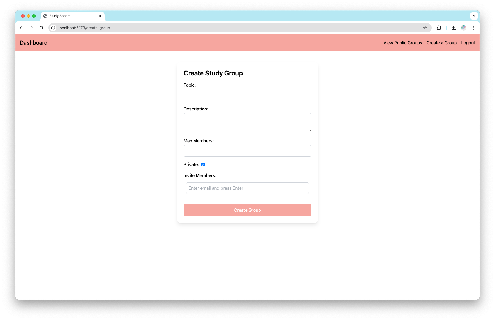
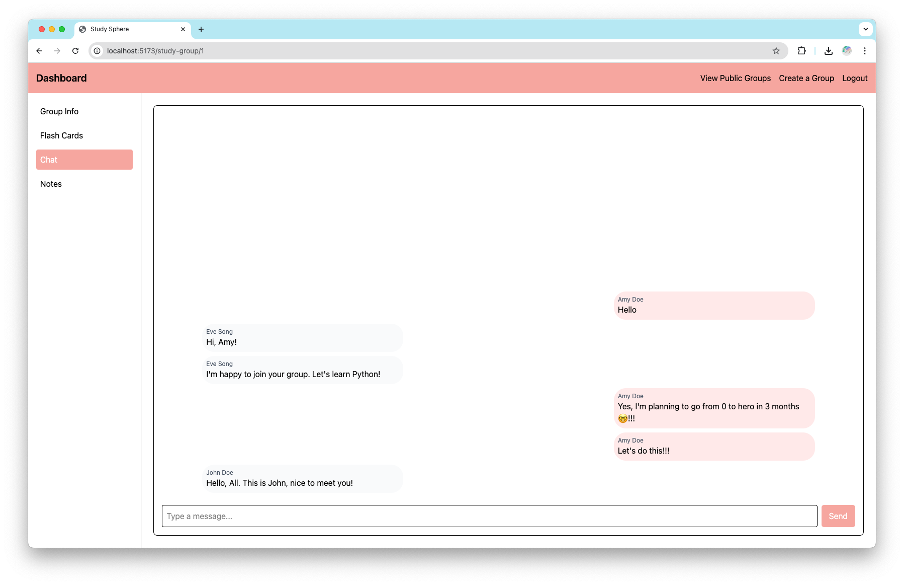
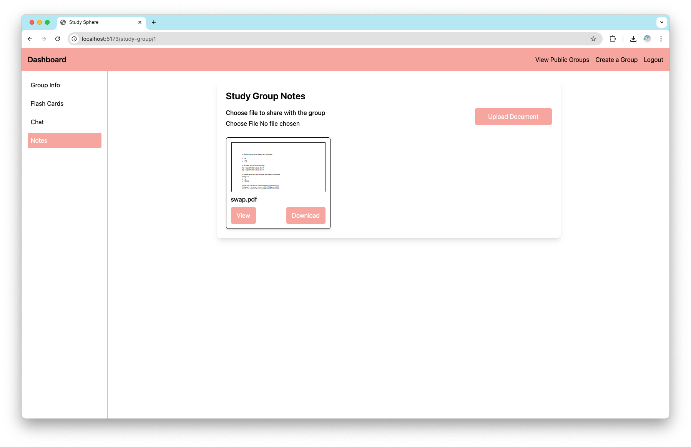
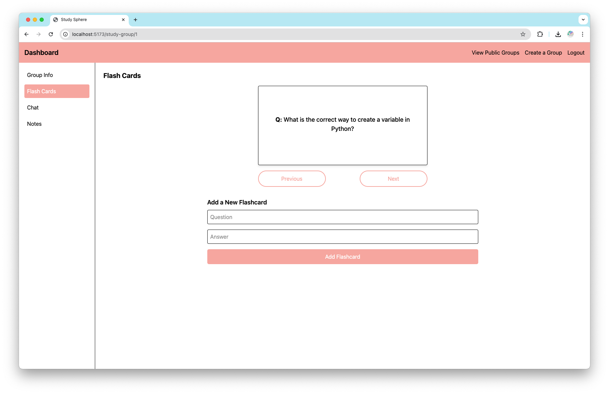

# StudySphere

StudySphere is a web application designed to help students create and manage study groups, collaborate via chat, share study materials, and schedule study sessions.

## Features

**User Authentication** – Login & Signup using JWT Authentication and CORS

 

 

- **Study Group Management** – Create and join study groups

 


- **Real-Time Chat** – WebSockets using the STOMP protocol



- **File Sharing** – Upload, view, and download study materials (PDFs)



- **Flashcards** – Create and review flashcards for study groups




## Tech Stack

- **Frontend:** React, Vite, Tailwind CSS
- **Backend:** Spring Boot, WebSockets, REST API
- **Database:** PostgreSQL
- **Storage:** Local file storage (with future cloud integration planned)

## Installation & Setup

### Prerequisites

Ensure you have the following installed on your system:

- **Node.js & npm** – Required for frontend development
- **Java 17+** – Required for running the Spring Boot backend
- **PostgreSQL** – Database for storing study group information

### Backend Setup

1. Clone the repository:
   ```sh
   git clone https://github.com/jsravanis/study-sphere.git
   cd study-sphere/backend
   ```
2. Configure the database in `application.properties`:
   ```properties
   spring.datasource.url=jdbc:postgresql://localhost:5432/studysphere
   spring.datasource.username=your_db_user
   spring.datasource.password=your_db_password
   ```
3. Configure environment variable for JWT_SECRET_KEY:
   ```shell
    export JWT_SECRET_KEY="your_secret_key"
   ```

4. Run the backend server:
   ```sh
   ./mvnw spring-boot:run
   ```

### Frontend Setup

1. Navigate to the frontend directory:
   ```sh
   cd ../frontend
   ```
2. Install dependencies:
   ```sh
   npm install
   ```
3. Start the development server:
   ```sh
   npm run dev
   ```

## API Endpoints

### Authentication

- `POST /auth/signup` – Register a new user
- `POST /auth/login` – Authenticate user & receive token

### Study Groups (only few listed)

- `POST /studygroups/create` – Create a new study group
- `GET /studygroups/{id}` – Retrieve study group details
- `GET /studygroups` – List all available study groups

### Users

- `POST /users/{userId}/profile` – Retrieves all the details of the user

### Chat

- **WebSocket URL:** `ws://localhost:8080/study-group-ws`
- `SEND /chat/{groupId}` – Send a message
- `SUBSCRIBE /topic/chat/{groupId}` – Receive messages

### File Uploads

- `GET /pdfs/studyGroup/{studyGroupId}` – Retrieve all pdfs for a study group
- `POST /pdfs/upload` – Upload a file (supports pdf file type)

## Deployment Plan

- **Frontend:** Vercel/Netlify (planned)
- **Backend:** Render/Heroku (planned)
- **Database:** Railway/NeonDB (planned)

## Further improvements
- **Study Session Scheduling** – Plan and organize group study sessions
- **Mentor Support** – Users can join as mentors and give guidance in the study group or Users can interact with the joined mentors for guidance
- **AI integration** – Use AI to create flashcards from the uploaded notes. Use AI for summarization of chat, uploaded notes and add a feature to chat with AI as well.

**Author:** Jaya Sravani Sirigineedi\
**Project Origin:** Submitted the project's initial version in a hackathon with a group.
